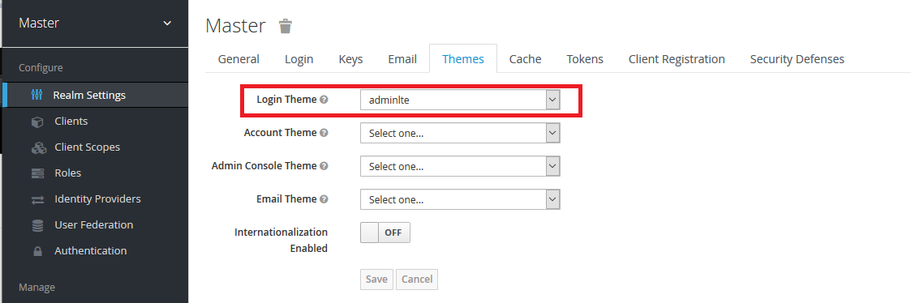
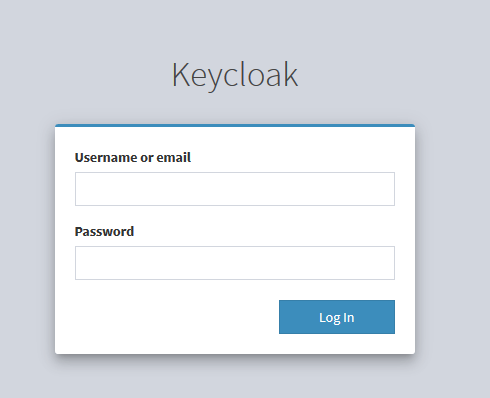

# Nginx_ssl_keycloak_mysql_redis-docker
Handy docker compose example file that sets up a nginx_ssl_keycloak_mysql_redis as a service ready to use.
This compose file is based on serveral other repos and online articles. This repos works as an example of use only.

## Pre-Requirements
Knowledge about all elements in the compose file before use.
> Nginx and Let’s Encrypt it taken from this repo. You can find more information here https://github.com/wmnnd/nginx-certbot.

> The `init-letsencrypt.sh` fetched from https://github.com/wmnnd/nginx-certbot has been slightly modefied in this example. 
> In this example you can add domains from comand line, like this:
   
   - `./init-letsencrypt.sh [staging | production] <domain1 domain2 ...> `  

> Note: In this example The mariadb is build from compose file to use timezone Europe/Oslo. Remove if not needed.

## Handy styff
This docker compose file sets up:
    
    - nginx with ssl sertificates
        - Inclues config app.conf file but to be used as example only.
        - based on some articles and repos
            https://github.com/wmnnd/nginx-certbot
            https://medium.com/@pentacent/nginx-and-lets-encrypt-with-docker-in-less-than-5-minutes-b4b8a60d3a71

    - Keycloak for authentication with custom "adminlte" login page
        - based on some articles:
            https://medium.com/@shivangbhandari/custom-themes-for-keycloak-631bdd3e04e5
            https://www.mai1015.com/development/2019/05/05/docker-keycloak-proxy-behind-nginx/
            https://www.keycloak.org/docs/4.8/authorization_services/
            https://www.youtube.com/watch?v=XJYy6Aq-PJ8
        - Example theme from:
            https://github.com/MAXIMUS-DeltaWare/adminlte-keycloak-theme

    - mysql with config
        - Inclues config my.cnf file but to be used as example only. Remember to change my.cnf gile dependent of what kind of mariadb version you use.

    - Redis


## Run with ssl sertificates
```
# Run the docker compose
docker-compose up -d --build

# Init you sertificates
# Depending on you user rights it could be that you have to give the user access to run the shell file.
# Also use staging when testing or you will have to wait for a while between each run.
# Example: chmod +x username:usergroup ./init-letsencrypt.sh
./init-letsencrypt.sh [staging | production] <domain1 domain2 ...>

```

## Run without ssl sertificates ( local testing)
```
# Run the docker compose
docker-compose -f docker-compose-without-ssl.yml up -d --build
```

## Test the stuff
Examples below will help you test that stuff is running correctly.

### Nginx test
```
# go to your browser:
# expected result: web site opens
http://127.0.0.1:8180
```

### Keycloak test
```
# go to your browser:
# expected result: web site opens
http://127.0.0.1:8180
```
Now, log in as admin and change the default theme for the one in this example:
[](screenshots/keycloak_theme_example_01.png) [](screenshots/keycloak_theme_example_02.png) [](screenshots/screen3.png)

### Monetdb test
```
# In command line:
# expected result:
# +--------------------+
# | Database           |
# +--------------------+
# | information_schema |
# | keycloak           |
# +--------------------+
docker exec -it mariadb mysql -ukeycloak -pkeycloak -e "SHOW DATABASES;"
```

### Redis test
```
# In command line:
# expected result: < PONG
docker exec -it redis redis-cli PING

```